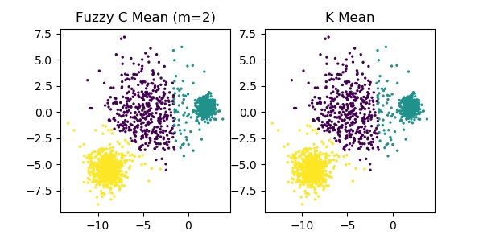
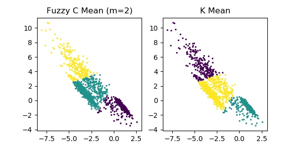

## 聚类

### 1. K Mean

### 2. 模糊C均值（Fuzzy C Mean）

参考文献

> [1] 模糊C均值聚类-FCM算法, 博客园, [链接](https://www.cnblogs.com/wxl845235800/p/11046248.html)
> [2] 模糊C均值聚类的公式推导, 博客园 [链接](https://www.cnblogs.com/wxl845235800/p/11053261.html)
> [3] 模糊c均值聚类, 百度文库, p.7 [链接](https://wenku.baidu.com/view/4ed1737f02020740bf1e9b74.html)

#### 2.1. 基本原理

模糊C均值聚类的目标：
$$
\min J = \sum_{i=1}^{C} \sum_{j=1}^{N} \mu_{ij}^{m} d(x_j,c_{i})
$$
约束条件：
$$
\text{s.t.} \space \sum_{i=1}^{C} \mu_{ij} = 1, \space \forall j=1,2,\cdots,N
$$
上式中，${x_j(j=1,2,\cdots,N)}$ 表示第 ${j}$ 个样本；$c_i({i=1,2,\cdots,C)}$ 表示第 ${i}$ 个类的中心；${\mu_{ij}^{m}(0 \leq \mu_{ij}^{m} \leq 1)}$ 表示第 ${j}$ 个样本隶属于第 ${i}$ 类的隶属度；约束条件 ${\sum_{i=1}^{C} \mu_{ij}^m = 1 (j=1,2,\cdots,N)}$ 表示每个样本 ${j}$ 到所有类中心的隶属度之和为1；${m(0<m<\infty)}$是模糊化加权指数；${d(x_j,c_{i})}$ 表示距离度量函数，一般取欧式距离的平方，即 ${d(x_j,c_{i})=d_{ji}=||x_j-c_i||^2}$。

#### 2.2. 求解过程

#### 2.3. 算法流程

综上，FCM的算法步骤为：

**Step 1.**  设置 ${C}$ 和 ${m}$，随机初始化隶属度。

**Step 2.**  计算模糊聚类中心：
$$
c_i = \sum_{j=1}^N \frac{\mu_{ij}^m}{\sum_{k=1}^N \mu_{ik}^m}x_j, \space i=1,2,\cdots,C
$$

**Step 3.** 计算隶属度：
$$
\mu_{ij} = \frac{1}{\sum_{k=1}^C{\left(\frac{d_{ij}}{d_{kj}}\right)}^{\frac{1}{m-1}}}
= \frac{{d_{ij}}^{-\frac{1}{m-1}}}{\sum_{k=1}^C{{d_{kj}}^{-\frac{1}{m-1}}}}
$$

**Step 4.** 重复Step2和Step3直到聚类中心 ${c_i}$ 的变化满足收敛。

#### 2.4. 代码

#### 2.5. 实验结果对比

以`scikit-learn`中的测试集（[链接](https://scikit-learn.org/stable/auto_examples/cluster/plot_kmeans_assumptions.html)），进行测试，并与Kmean算法对比。
其中主要参数： ${K=3}$，${m=2}$，度量距离为欧拉距离的平方。

### 3. 