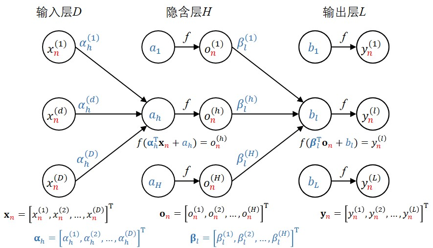

# Neural Network

## 1. 神经网络

### 1.1. 基本原理

假设有 ${N}$ 个样本 ${\left\{({{\mathbf{x}}_{n}},{{\mathbf{y}}_{n}}) \right\}_{n=1}^{N}}$，其中输入向量 ${{\mathbf{x}}_{n}} = {{\left[{{x}_{n}^{(1)}},{{x}_{n}^{(2)}},...,{x_{n}^{(D)}} \right]}^{\mathbf{T}} \in {{\mathbb{R}}^{D\times1}}}$，输出向量 ${{\mathbf{y}}_{n}}\text{=}{{\left[{{y}_{n}^{(1)}},{{y}_{n}^{(2)}},...,{{y}_{n}^{(L)}} \right]}^{\mathbf{T}}}\in {{\mathbb{R}}^{L\times
1}}$。隐含层神经元个数为 ${H}$。

则第 ${h(h=1,2,...,H)}$ 个隐含层神经元输出为：
$$
\begin{align}
o_n^{(h)} &= f \left( \boldsymbol{\alpha}_{h}^\mathbf{T} \mathbf{x}_n+a_h \right) \\
&= f \left( \sum_{d=1}^D\alpha_h^{(d)} x_n^{(d)} + a_h \right) 
\end{align}
$$

其中  ${{\boldsymbol{\alpha}}_{h}} = {{\left[{{\alpha}_{h}^{(1)}},{{\alpha}_{h}^{(2)}},...,{\alpha_{h}^{(D)}} \right]}^{\mathbf{T}}}$ 表示第输入层到隐含层第 ${h}$ 个神经元的连接权重，${a_h}$  表示隐含层第 ${h}$ 个神经元偏置。

第 ${l(l=1,2,...,L)}$ 个输出层神经元的输出为：

$$
\begin{align}
p_n^{(l)} & = f \left( \boldsymbol{\beta}_{l}^\mathbf{T} \mathbf{o}_n+b_l \right) \\
& = f \left( \sum_{h=1}^H\beta_l^{(h)} o_n^{(h)} + b_l \right) \\
& = f \left( \sum_{h=1}^H\beta_l^{(h)} \cdot f \left( \boldsymbol{\alpha}_{h}^\mathbf{T} \mathbf{x}_n+a_h \right) + b_l \right) \\
& = f \left( \sum_{h=1}^H\beta_l^{(h)} \cdot f \left( \sum_{d=1}^D\alpha_h^{(d)} x_n^{(d)} + a_h \right)  + b_l \right)
\end{align}
$$

其中  ${{\mathbf{o}}_{n}} = {{\left[{{o}_{n}^{(1)}},{{o}_{n}^{(2)}},...,{o_{n}^{(H)}} \right]}^{\mathbf{T}}}$，${f(\cdot)}$ 为激活函数。

### 1.2. 优化目标

解决回归问题的神经网络一般以最小均方误差 MSE（mean square error） 为优化目标，对于单个样本的损失函数为：

$$
\begin{align}
L(\mathbf{\hat{y}}_n,\mathbf{y}_n) 
&= ||\mathbf{\hat{y}}_n-\mathbf{y}_n||^2 \\
& = \sum_{l=1}^L \left(\hat{y}_n^{(l)}-y_n^{(l)} \right)^2 \\
& = \sum_{l=1}^L \left( 
		f \left( \sum_{h=1}^H\beta_l^{(n)} \cdot f \left( 
			\sum_{d=1}^D\alpha_h^{(d)} x_n^{(d)} + a_h 
		\right) + b_l 
	\right) - y_n^{(l)} \right)^2 
\end{align}
$$

则 ${N}$ 个样本的总损失函数为：

$$
\begin{align}
L(\mathbf{\hat{y}},\mathbf{y}) 
= \text{MSE} 
& = \frac{1}{N} \sum_{n=1}^N L(\mathbf{\hat{y}}_n, \mathbf{y}_n)  \\
& =  \frac{1}{N}\sum_{n=1}^N ||\mathbf{\hat{y}}_n-\mathbf{y}_n||^2 \\
& = \frac{1}{N}\sum_{n=1}^N \left( 
	\sum_{l=1}^L \left( 
		f \left( \sum_{h=1}^H\beta_l^{(n)} \cdot f \left( 
			\sum_{d=1}^D\alpha_h^{(d)} x_n^{(d)} + a_h 
		\right) + b_l 
	\right) - y_n^{(l)} \right)^2 
\right)
\end{align}
$$

### 1.3. 梯度下降

神经网络中参数更新：

$$
v \leftarrow v + \Delta v = v - \eta \frac{\partial{L(\mathbf{\hat{y}},\mathbf{y};v)}}{\partial{v}}
$$

对输出层的偏置 ${b_l}$ 求偏导：

$$
\begin{align}
\frac{\partial{L(\mathbf{\hat{y}}_n},\mathbf{y}_n)}{\partial{b_l}} 
&= \frac{\partial}{\partial{b_l}}{\left(p_n^{(1)}-y_n^{(1)}\right)^2} + 
   \underbrace{\frac{\partial}{\partial{b_l}}{\left(p_n^{(l)}-y_n^{(l)}\right)^2}}_{\text{about to }b_l} + 
   \cdots + 
   \frac{\partial}{\partial{b_l}}{\left(p_n^{(L)}-y_n^{(L)}\right)^2}
\\
&= \frac{\partial{L(\mathbf{p}_n},\mathbf{y}_n)}{\partial{p_n^{(l)}}} \cdot 		   \frac{\partial{p_n^{(l)}}}{\partial{b_l}} 
\\
&=  2 (p_n^{(l)}-y_n^{(l)}) \cdot
    f'\left( \boldsymbol{\beta}_{l}^\mathbf{T} \mathbf{o}_n+b_l \right)
\end{align}
$$

同理，对隐含层到输出层的链接权重 ${\boldsymbol{\beta}_{l}}$ 求偏导：

$$
\begin{align}
\frac{\partial{L(\mathbf{\hat{y}}_n},\mathbf{y}_n)}{\partial{\boldsymbol{\beta}_{l}}} 
&= \frac{\partial{L(\mathbf{\hat{y}}_n},\mathbf{y}_n)}{\partial{p_n^{(l)}}} \cdot 		   \frac{\partial{p_n^{(l)}}}{\partial{\boldsymbol{\beta}_{l}}} 
\\
&= 2(p_n^{(l)} - y_n^{(l)}) \cdot
   \mathbf{o}_n^\mathbf{T} \cdot
  f'\left( \boldsymbol{\beta}_{l}^\mathbf{T} \mathbf{o}_n+b_l \right)
\end{align}
$$

注意：${\frac{\partial{L(\mathbf{\hat{y}}_i},\mathbf{y}_i)}{\partial{\boldsymbol{\beta}_{l}}}}$ 属于标量对向量，${\frac{\partial{\boldsymbol{\beta}_{l}^\mathbf{T} \mathbf{o}_n}}{\partial{\boldsymbol{\beta}_{l}}} = \mathbf{o}_n}$ 。

对隐含层的偏置 ${a_h}$ 求偏导：

$$
\begin{align}
\frac{\partial{L(\mathbf{p}_n,\mathbf{y}_n)}}{\partial{a_h}} 
&= \frac{\partial}{\partial{a_h}}{\left(p_n^{(1)}-y_n^{(1)}\right)^2} + 
   \frac{\partial}{\partial{a_h}}{\left(p_n^{(l)}-y_n^{(l)}\right)^2} + \cdots + 
   \frac{\partial}{\partial{a_h}}{\left(p_n^{(L)}-y_n^{(L)}\right)^2}
\\
&= \frac{\partial{L(\mathbf{p}_n,\mathbf{y}_n)}}{\partial{p_n^{(1)}}} \cdot 		   \frac{\partial{p_n^{(1)}}}{\partial{o_n^{(h)}}} \cdot 
\frac{\partial{o_n^{(h)}}}{\partial{a_h}} + 
\frac{\partial{L(\mathbf{p}_n,\mathbf{y}_n)}}{\partial{p_n^{(2)}}} \cdot 		   \frac{\partial{p_n^{(2)}}}{\partial{o_n^{(h)}}} \cdot 
\frac{\partial{o_n^{(h)}}}{\partial{a_h}} + \cdots +
\frac{\partial{L(\mathbf{p}_n,\mathbf{y}_n)}}{\partial{p_n^{(L)}}} \cdot 		   \frac{\partial{p_n^{(L)}}}{\partial{o_n^{(h)}}} \cdot 
\frac{\partial{o_n^{(h)}}}{\partial{a_h}}
\\
&= \left[ 2 (p_n^{(1)}-y_n^{(1)}) \cdot
		  f' \left( \boldsymbol{\beta}_{1}^\mathbf{T} \mathbf{o}_n+b_1 \right) \cdot 
		  \beta_1^{(h)} \cdot 
    	  f' \left( \boldsymbol{\alpha}_{h}^\mathbf{T} \mathbf{x}_n+a_h \right) 
	\right] +
    \left[ 2 (p_n^{(2)}-y_n^{(2)}) \cdot
    	f' \left( \boldsymbol{\beta}_{2}^\mathbf{T} \mathbf{o}_n+b_2 \right) \cdot 
		\beta_2^{(h)} \cdot 
    	f' \left( \boldsymbol{\alpha}_{h}^\mathbf{T} \mathbf{x}_n+a_h \right) 
    \right] +
    \left[ 2 (p_n^{(L)}-y_n^{(L)}) \cdot 
    	f' \left( \boldsymbol{\beta}_{L}^\mathbf{T} \mathbf{o}_n+b_L \right) \cdot 
		\beta_L^{(h)} \cdot 
    	f' \left( \boldsymbol{\alpha}_{h}^\mathbf{T} \mathbf{x}_n+a_h \right) 
    \right]
\\
&= \sum_{l=1}^L \left[ 2 (p_n^{(l)}-y_n^{(l)}) \cdot 
    	f' \left( \boldsymbol{\beta}_{l}^\mathbf{T} \mathbf{o}_n+b_l \right) \cdot 
		\beta_l^{(h)} \cdot 
    	f' \left( \boldsymbol{\alpha}_{h}^\mathbf{T} \mathbf{x}_n+a_h \right) 
    \right]
\end{align}
$$

同理，对输入层到隐含层的链接权重 ${\boldsymbol{\alpha}_h}$ 求偏导：

$$
\begin{align}
\frac{\partial{L(\mathbf{p}_n,\mathbf{y}_n)}}{\partial{\boldsymbol{\alpha}_h}} 
&= \sum_{l=1}^L \left[ 2 (p_n^{(l)}-y_n^{(l)}) \cdot 
    	f' \left( \boldsymbol{\beta}_{l}^\mathbf{T} \mathbf{o}_n+b_l \right) \cdot 
		\beta_l^{(h)} \cdot 
    	f' \left( \boldsymbol{\alpha}_{h}^\mathbf{T} \mathbf{x}_n+a_h \right) \cdot 
    	\mathbf{x}_n
    \right]
\end{align}
$$

### 1.4. 反向传播

