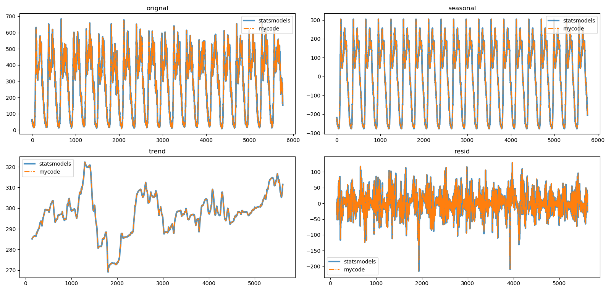
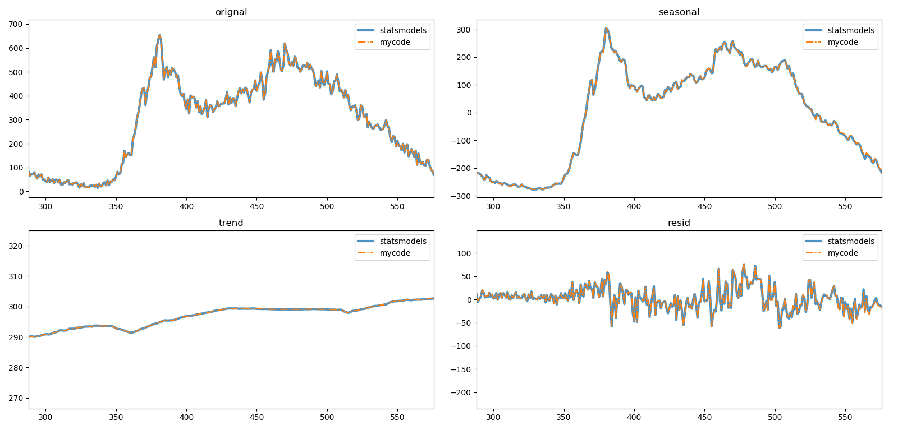

## STL

Seasonal-Trend Decomposition Procedure Based on LOESS

### 1. 移动平均季节分解

> 参考文献
>
> [1] scipy.org: [`scipy.signal.convolve`](https://docs.scipy.org/doc/scipy/reference/generated/scipy.signal.convolve.html)函数
>
> [2] python学习园: [19. Scipy Tutorial-卷积convolve](http://liao.cpython.org/scipytutorial19/)
>
> [3] statsmodels v0.11.0dev0 (+513):  [`statsmodels.tsa.seasonal.seasonal_decompose`](http://www.statsmodels.org/devel/generated/statsmodels.tsa.seasonal.seasonal_decompose.html), 函数[source](http://www.statsmodels.org/devel/_modules/statsmodels/tsa/seasonal.html#seasonal_decompose)
>
> [4] statsmodels v0.11.0dev0 (+513): [`statsmodels.tsa.filters.filtertools.convolution_filter`](http://www.statsmodels.org/devel/generated/statsmodels.tsa.filters.filtertools.convolution_filter.html), 函数, [source](http://www.statsmodels.org/devel/_modules/statsmodels/tsa/filters/filtertools.html#convolution_filter)

#### 1.1. 基本思想

设原始时间序列为 ${X(t)}$，周期为 ${P}$，趋势序列为 ${T(t)}$，循环（季节）序列为 ${C(t)}$ ，残差（余项）序列我 ${R(t)}$

**Step 1：** 对 ${X(t)}$ 做长度为 ${P}$ 的移动平均，得到趋势变量 ${T(t)}$；

   实际操作是利用`scipy.signal.convolve(x, filer, model='valid')`的卷积运算。

   一次移动平均操作会使原始序列在首尾共丢失 ${P}$ 个数字，因此会有额外的趋势外推公式。

**Step 2：**去趋势，${\widetilde{X}=X(t)-T(t)}$

**Step 3：** 对去趋势的序列 ${\widetilde{X}}$ 每一周期的相同时刻的数据求平均值，得到循环序列 ${C(t)}$；

   ${C(t)}$ 会减去均值，平移到以0为中心。

**Step 4：** 计算残差序列：${R(t)=X(t)-T(t)-C(t)}$。

#### 1.2. 代码过程

##### 1.2.1. `statemodel`库

[`statsmodels.tsa.seasonal.seasonal_decompose`](http://www.statsmodels.org/devel/generated/statsmodels.tsa.seasonal.seasonal_decompose.html)

关键参数：`period`指定循环周期（季节周期）

##### 1.2.2. 自写代码

```python
def SeasonalDecespostion(original, period):
    # 时间序列长度
    length = original.shape[0]
    # 卷积算子
    if period % 2 == 0:  # split weights at ends
        filt = np.array([.5] + [1] * (period - 1) + [.5]) / period
    else:
        filt = np.repeat(1. / period, period)
    # 移动平均求趋趋势序列，两端未补全
    trend = signal.convolve(original, filt, mode='valid')
    # 平均法求周期序列（一周期）
    period_averages = np.array([np.mean(original[i::period], axis=0) for i in range(period)])
    # 周期序列平移到原点
    period_averages -= np.mean(period_averages)
    # 扩展周期序列
    seasonal = np.tile(period_averages.T, length // period + 1).T[:length]
    # 求残差序列
    resid = original[int(period/2):length-int(period/2)] - seasonal[int(period/2):length-int(period/2)] - trend
    return trend, seasonal, resid
```

##### 1.2.3 分解结果

自己coding与`seasonal_decompose`存在一定的误差，但不明显。

- 4周交通流量分解结果对比



- 其中1天（第2天）交通流量分解结果对比




### 2. STL

> 参考文献
>
> [1] 局部加权回归LOWESS, 博客园, [链接](https://www.cnblogs.com/en-heng/p/7382979.html)
>
> [2] Trevor Hastie, Robert Tibshirani, and Jerome Friedman. The elements of statistical learning. Springer, Chapter 6.
>
> [3] William S. Cleveland, Robust Locally Weighted Regression and Smoothing Scatterplots, Journal of the American Statistical Association, 1979, 74:368, 829-836

#### 2.1. LOESS

##### 2.1.1. 基本思路

局部加权回归（Locally Weighted Regression, LOESS, 或 LOWESS）。LOESS与KNN回归类似，假设有 ${N}$ 个样本 ${\{\mathbf{x}_i,y_i \}_{i=1}^N}$，预测值 ${\hat{y}_j=f(\mathbf{x}_j)}$ 是由与 ${\mathbf{x}_j}$ 邻近的的 ${K}$ 个点  ${\{\mathbf{x}_k,y_k \}_{k=1}^K} \subset  {\{\mathbf{x}_i,y_i \}_{i=1}^N}$ 加权得到，即：

$$
\hat{y}_j = f(\mathbf{x}_j) =
\frac{\sum_{k=1}^K \kappa_{\lambda} (\mathbf{x}_j,\mathbf{x}_k)  y_k}
{\sum_{k=1}^K \kappa_{\lambda} (\mathbf{x}_j,\mathbf{x}_k) }
$$

其中 ${\kappa}$ 为权重参数：

$$
\kappa_{\lambda} (\mathbf{x}_j,\mathbf{x}_k) = D\left(\frac{|\mathbf{x}_j-\mathbf{x}_k|}{\lambda} \right)
$$

其中 ${D(t)}$ 一般选择 Epanechnikov 核函数：

$$
D(t) = \left\{ \begin{array}{l}
\frac{3}{4}(1-t^2),  & \text{if} \space |t|<1
\\0,  & \text{else}
\end{array} \right.
$$

上式中 ${\lambda}$ 为 Epanechnikov 核函数的核宽度，表示：${\mathbf{x}_j}$ 与第 ${K}$ 近的样本 ${\mathbf{x}_{[K]}}$ 的距离：

$$
\lambda = |\mathbf{x}_j - \mathbf{x}_{[K]}|
$$

##### 2.1.2. 边界问题

对于 $\{{\mathbf{x}_i\}_{i=1}^N}$ 序列的开始与结束区段的点，其左右邻域是不对称的，导致了平滑后的值偏大或偏小。因此，需要对权值做再修正，假定对的估计值 ${\mathbf{x}_j = \left[x_j^{(1)}, \cdots, x_j^{(d)} \right]^{\mathbf{T}}}$ ：

$$
\hat{y}_j = f(\mathbf{x}_j) = \beta_0 + \sum_{d=1}^D \beta_d x_j^{(d)}
$$

定义目标函数：

$$
\min_{\beta_1,\beta_2,\cdots} \sum_{i=1}^N \kappa(\mathbf{x}_j, \mathbf{x}_i) \left(y_i - \hat{y}_i \right)^2 
= \min_{\beta_1,\beta_2,\cdots} \sum_{i=1}^N \kappa(\mathbf{x}_j, \mathbf{x}_i) \left(y_i - \beta_0 - \sum_{d=1}^D \beta_d x_j^{(d)} \right)^2
$$

定义：

$$
\mathbf{X} = \begin{pmatrix}
	1      & x_1^{(1)} & \cdots & x_1^{(d)} \\
	1      & x_2^{(1)} & \cdots & x_2^{(d)} \\
	\vdots & \vdots    & \ddots & \vdots    \\
	1      & x_N^{(1)} & \cdots & x_N^{(d)} \\
\end{pmatrix}, \quad 
\mathbf{W}_{\mathbf{x}_j} = \begin{pmatrix}
	\kappa_{\lambda}(\mathbf{x}_j, \mathbf{x}_1) & 0 & \cdots & 0 \\
	0 & \kappa_{\lambda}(\mathbf{x}_j, \mathbf{x}_2) & \cdots & 0 \\
	\vdots & \vdots  & \ddots & \vdots \\
	0 & 0 & \cdots & \kappa_{\lambda}(\mathbf{x}_j, \mathbf{x}_N) \\
 \end{pmatrix}
$$

$$
\mathbf{B} = [\beta_0, \beta_1, \cdots, \beta_d]^\mathbf{T}, \quad 
\mathbf{Y} = [y_1, y_2, \cdots, y_N]^\mathbf{T}
$$

目标函数可改写为：

$$
\min_{\mathbf{B}} (\mathbf{Y} - \mathbf{X} \mathbf{B})^{\mathbf{T}} \mathbf{W}_{\mathbf{x}_j} (\mathbf{Y} - \mathbf{X} \mathbf{B})^{\mathbf{T}}
$$

求偏导，可得到

$$
\mathbf{B} = (\mathbf{X}^{\mathbf{T}} \mathbf{W}_{\mathbf{x}_j} \mathbf{X})^{-1} (\mathbf{X}^{\mathbf{T}} \mathbf{W}_{\mathbf{x}_j} \mathbf{Y})
$$

则估计值

$$
\hat{y}_j = f(\mathbf{x}_j) = \mathbf{E}_{\mathbf{x}_j} \mathbf{B}
$$

上式中 ${\mathbf{E}_{\mathbf{x}_j} = \left[1, x_j, \cdots, x_j^{(d)} \right]^{\mathbf{T}}}$。

需要注意的是，虽然在上述一系列式子中，评估 ${\mathbf{x}_j}$ 使用了所有的样本 ${\mathbf{x}_i(i=1,2,\cdots,N)}$，但是由于 Epanechnikov 核函数 ${D(t)}$ 的存在，使得在核宽度 ${\lambda}$ 之外的样本（${A = \left\{ \mathbf{x}_i \left| |\mathbf{x}_i-\mathbf{x}_{[K]}| > \lambda = |\mathbf{x}_j - \mathbf{x}_{[K]}|, i=1,2,\cdots,N \right. \right\} }$），其对应的 ${\kappa_{\lambda}(\mathbf{x}_j, \mathbf{x}_i)=0, \forall \mathbf{x}_i \in A}$ 。所以，只有  ${\mathbf{x}_j}$ 邻近的 ${K}$ 个样本参与了评估。

##### 2.1.3. Robust LOWESS

通过Robust方法，避免outlier对回归的影响。

**Step1: **在计算完估计值 ${\hat{y}_i(i=1,2,\cdots,N)}$ 后，计算残差：
$$
e_i = y_i - \hat{y}_i
$$

**Step2: **并计算残差绝对值序列 ${\{|e_i|\}_{i=1}^N}$ 的中位值（median）${s = \text{median} \{|e_i|\}}$

计算 robustnest weight：

$$
\delta_k = Bisq \left( \frac{e_k}{6s} \right)
$$

其中，${Bisq(t)}$ 为 bisquare 函数：

$$
Bisq(t) = \left\{ \begin{array}{ll}
{(1-t^2)^2}, & {\text{if} \space |t| < 1} \\
{0},         & {\text{if} \space |t| \ge 1} \\
\end{array}\right.
$$

**Step3: **在对点 ${\mathbf{x}_j}$ 进行评估时，用 ${\delta_k}$ 修正 ${\kappa(\mathbf{x}_j, \mathbf{x}_k)}$，即：

$$
\kappa(\mathbf{x}_j, \mathbf{x}_k) \leftarrow \delta_k \cdot \kappa(\mathbf{x}_j, \mathbf{x}_k), \quad k=1,2,\cdots,K
$$

**Step4: **利用修正后的 ${\kappa(\mathbf{x}_j, \mathbf{x}_k)}$ 对 ${\mathbf{x}_j}$ 进行评估。

**Step5: **重复 Step1-4直到满足循环终止条件。

#### 2.2 LOESS 程序实现

`pyloess.py`中`LocallyWeightedRegression`类实现，主要参数说明：

| 参数            | 类型   | 含义                                 |
| --------------- | ------ | ------------------------------------ |
| `k`             | `int`  | 邻近样本个数，决定了核宽度           |
| `smooth_edge`   | `bool` | 是否对边界的点重新估计               |
| `robust`        | `bool` | 是否视同Robust方法减小outliers的影响 |
| `robust_n_iter` | `int`  | Robust方法的迭代次数                 |

注意：`smooth_edge=Fasle` 同时 `robust=True` 尚未实现。

测试结果在[`test_stl.ipynb`](stl_test.ipynb)中

#### 2.3 STL

> 参考文献
>
> [1] 时间序列分解算法：STL, 博客园, [连接](https://www.cnblogs.com/en-heng/p/7390310.html)
>
> [2] Cleveland, R. B., W. S. Cleveland, J. E. McRae and I. Terpenning. STL : A seasonal-trend decomposition procedure based on loess.  Journal of Official Statistics, 1990, 6(1), 3–73.
>
> [3] Xiong, Tao , C. Li , and Y. Bao . "Seasonal forecasting of agricultural commodity price using a hybrid STL and ELM method: Evidence from the vegetable market in China." *Neurocomputing* 275(2018):2831-2844.
>
> [4] D. Chen, J. Zhang and S. Jiang, "Forecasting the Short-Term Metro Ridership With Seasonal and Trend Decomposition Using Loess and LSTM Neural Networks," in *IEEE Access*, vol. 8, pp. 91181-91187, 2020, 

##### 2.3.1 基本思路

设原始时间序列为 ${X(t)}$，周期长度为 ${C}$，STL可以将原始序列 ${X(t)}$ 分解为：趋势序列为 ${T(t)}$，周期（季节）序列为 ${P(t)}$ ，残差（余项）序列${R(t)}$：

$$
X(t) = T(t) + P(t) + R(t)
$$

##### 2.3.2 代码实现

`statsmodels`库中[`tsa.seasonal.STL`](https://www.statsmodels.org/stable/generated/statsmodels.tsa.seasonal.STL.html)类实现。

自己code的`pystl.py`实现，并且改进了两项：1.缺失值的处理；2.包外样本的分解（尚未完成）。

测试结果在[`test_stl.ipynb`](stl_test.ipynb)中。


